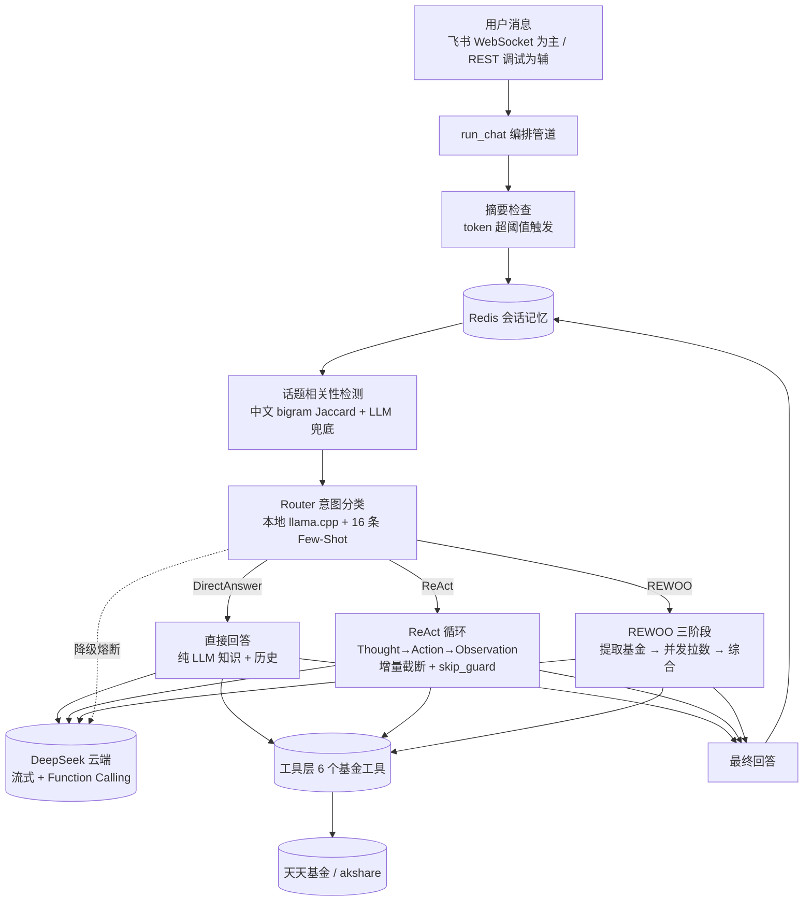

# 基金投研 AI Agent

一个面向公募基金场景的 **大模型智能体应用**：用本地小模型做意图路由，用云端大模型做推理与综合，按问题类型在 **ReAct（逐步推理）** 与 **REWOO（Plan-and-Solve 并发）** 两种 Agent 范式间自动切换，通过 Function Calling 调用基金数据工具，完成投研问答、多维对比与盘中估值。

> **交互入口**：飞书机器人（WebSocket 长连接）。FastAPI REST 端点仅用于开发调试与面试演示调用链，非产品入口。

---

## 一、为什么做这个项目 / 解决什么问题

**业务场景**：中小企业投研/会议场景下的临时数据问数需求——"519702 最近表现怎么样"、"帮我对比下这两只基金的持仓"、"今天盘中这只基金大概涨多少"。

**为什么不直接用 ChatGPT**：基金数据是实时的（净值、持仓、盘中估值），通用 LLM 没有这些数据，会编。必须 Function Calling 调真实数据源，且要把"什么时候该调工具、调哪个工具"这件事做成可解释的。

**为什么自研而非用 LangChain/LangGraph**：可控且可解释。LangChain 的 AgentExecutor 把 Thought/Action/Observation 封在黑盒里，工具调用失败时难定位；自研后调用链每一步都写 trace，面试时能讲清每一层为什么这么写。代价是代码量多一点，但对一个演示项目而言，"能讲清楚"比"少写代码"更重要。

---

## 二、核心架构选择：为什么这么做

### 为什么用双 LLM（本地小模型 + 云端大模型）

**为什么这样选**：成本结构。路由分类、话题判断、REWOO 阶段1 提取基金名——这些是**高频低智任务**，每轮对话都要跑，用云端大模型烧钱且没必要。本地 Qwen3.5 9B 量化版跑这些任务几乎零边际成本，DeepSeek 只为真正的推理（ReAct 多步、REWOO 综合）付费。

**为什么不只用本地**：9B 模型做多步 ReAct 推理 + Function Calling + 长文本综合，能力不够，会幻觉工具名或丢失指令。所以重活留给云端，轻活留给本地。

**为什么不只用云端**：单轮路由分类用 DeepSeek 每次几千 token，一天几千轮对话就是一笔钱。本地模型把这部分成本压到零。

### 为什么有两种 Agent 范式（ReAct + REWOO）

**ReAct 的适用场景**：问题需要**链式推理**，下一步依赖上一步结果。例如"这只基金最近表现不好，是不是持仓有问题"——先查表现确认"表现不好"，再查持仓找原因。ReAct 的 Thought→Action→Observation 循环天然适合。

**REWOO 的适用场景**：问题需要**并发取数**，工具间无依赖。例如"对比 519702 和 161725 的表现和持仓"——两只基金 × 两个维度 = 4 次工具调用，全独立。ReAct 串行跑要 4 轮 LLM 调用，REWOO 用 `asyncio.gather` 一次并发，墙钟时间 ≈ 最慢单次调用。

**为什么 REWOO 阶段1 用本地 LLM 提取基金名**：这一步只做命名实体识别（"519702 和 161725" → ["519702", "161725"]），9B 模型足够，且本地零成本。如果用云端，每个 REWOO 请求多花一次 DeepSeek 调用。

### 为什么 router 用本地 LLM + Few-Shot 而非规则匹配

**为什么不用规则**：基金问答的自然语言变体太多。"帮我看下这只基"、"最近咋样"、"持仓都有些啥"、"盘中估值多少"——正则覆盖不全，维护成本高。

**为什么用 Few-Shot 而非 Fine-tune**：标注数据不够（中小企业场景，几百条都凑不齐），Fine-tune 容易过拟合且更新成本高。Few-Shot 16 条覆盖主要意图，新增意图改 prompt 即可，迭代快。

**为什么用本地 LLM 跑 router**：router 每轮对话都跑，是最高频的 LLM 调用。本地零成本 + 9B 分类能力够用。

### 为什么飞书为主、REST 为辅

**为什么飞书为主**：这是真实使用场景——投研人员在飞书群里问问题，机器人答。产品形态决定主入口。

**为什么保留 REST**：面试演示和开发调试。飞书演示要建测试企业、拉人进群、配 App ID，环境依赖重且现场易翻车；`curl /chat` + `/trace` 30 秒就能让面试官看到完整调用链。但 REST 无鉴权无限流，不是产品通道，README 里明确标注"勿暴露公网"。

---

## 三、关键工程决策：为什么这样做

### 预算管控：为什么是阈值检查，而非预扣对账

**真问题**：云端 LLM 按量计费，必须限预算。最初考虑过"预扣输入 + max_tokens 占坑，事后用真实 usage 补差退回"的精确计费方案，最终没采用。

**取舍：知道预扣更精确，但 chose 阈值检查**：

预扣方案理论上更严密——入口按 `count_tokens(messages) + max_tokens` 原子 DECRBY 占坑，流结束后用 DeepSeek 返回的真实 `total_tokens` 补差退回。能同时解决"剩余 1 token 照发 5 万"的单请求超额和并发超额。但本项目没采用，理由：

1. **异常路径复杂度**：ReAct 一次 `run_chat` 内最多 5 步 `cloud_chat`，每步都要预扣 + 补差。`CancelledError`（新消息取消旧任务）、`asyncio.TimeoutError`（90s 超时）、`budget_exceeded`（预算耗尽中途退出）三条异常路径下，"已预扣未补差"的退回逻辑分支多，漏一个就是额度泄漏
2. **单用户并发已被会话锁串行化**：飞书侧同 `open_id` 同时只跑一个 `run_chat`（新消息 `cancel` 旧任务），单用户并发超扣的场景不存在；API 调试端点定位为开发自测，并发不是真威胁
3. **预算粒度不需要这么精确**：中小企业单租户场景，日预算 55 万 token 量级，单次调用 3-5k token，量级差距足够大，软限 + 阈值已能把超额窗口压到可接受范围

**实际采用的方案**：
- **TTL 到当天 23:59:59**：避免 `ex=43200(12h) + nx=True` 组合导致的"当天额度翻倍" bug（早 8 点用，晚 8 点 key 过期后 nx=True 重新初始化满额）
- **check 阈值 `remaining > 2000`** 而非 `> 0`：防"剩余 1 token 照发 5 万"——ReAct 单次调用 3-5k token，剩 1 也放行就会单请求超额。阈值 2000 把超额窗口从"剩余 1~5000"收窄到"剩余 2001~5000"
- **DECRBY 扣真实 total_tokens**：DeepSeek 返回的权威值，事后扣减

**已知残留窗口**：剩余 2001~5000 token 时仍可能放行一次 5 万 token 的 ReAct 调用，扣完后余额变负。这是已知取舍——对中小企业单租户场景，这个窗口的期望损失（偶发一次超额）远小于预扣方案在异常路径上的实现复杂度成本。若未来扩展到多租户高并发，应回到预扣方案。

### 降级熔断：为什么不是"降级即放行"也不是"降级即限流"

**原设计的问题**：`local_chat` 连不上 llama-server 时静默切到 DeepSeek，路由/摘要/REWOO 提取三个高频本地调用全在无感烧云端钱，且不扣预算。llama-server 挂半小时烧的钱可能比正常态一天还多。

**取舍：知道降级限流更优雅，但 chose 熔断器**：

更优雅的方案是"降级即限流"——降级期间拒绝重路径（ReAct/REWOO），只放轻路径（DirectAnswer），降级调用按估算值扣预算。这样服务不中断，成本有持续上限。但本项目没采用，理由：

1. **降级态做精确计费是过度工程**：降级是异常态而非常态。在异常态维护一套独立的估算扣费逻辑（本地 LLM 无 usage 返回，只能靠 `count_tokens` 估，误差大），ROI 低
2. **目标是快速止血而非持续服务**：llama-server 挂掉本身就是该告警介入的异常，不应该让系统在降级态长时间承接流量。熔断器"允许少量降级 → 硬熔断抛错逼运维介入"更符合这个目标
3. **路径分流的实现成本**：要在 `local_chat` 之外维护"当前是否降级态"的全局状态，并让 router/summarizer/rewoo 各自判断"降级时是否拒绝"，跨模块耦合

**实际方案**：降级计数器，连续降级超 3 次强制关闭降级（抛错逼运维介入）。成功一次即清零。这样：
- 常态走本地零成本，保留双 LLM 架构的核心价值
- 异常态有硬上限（最多 3 次降级调用），不会静默烧钱
- llama-server 挂掉立即告警，而非等账单

**已知残留局限**：计数器在每次 `local_chat` 成功时清零。若 llama-server 是"间歇性抖动"（每隔几次成功就挂一次），计数器永远到不了 3，熔断不会触发，降级会间歇性发生。这种场景下降级烧的钱没有硬上限。这是已知取舍——间歇性抖动在实际部署中较少见（通常是稳定挂或稳定可用），且每次降级都有 `logger.warning` 告警，运维能从日志发现。若未来需要更严的防护，可改为"滑动窗口内降级次数"而非"连续降级次数"。

### ReAct token 放大：为什么 history 只传最近 2 轮

**真问题**：ReAct 每步把完整 buffer（含 Thought）+ observation（工具原文，持仓明细可能上千 token）append 进 messages。5 步下来 messages 滚雪球，单次 ReAct 烧的 prompt_tokens 是 DirectAnswer 的 5-10 倍。再加上全量 history（原 MAX_TOKEN_THRESHOLD=10000），单次 ReAct 总消耗可达 10 万 token。

**为什么不全量传 history**：ReAct 的 history 主要用于"判断哪些数据已有"，最近 2 轮已足够。10 轮前的对话对当前工具调用决策几乎无影响，但会让每步 prompt 多烧几千 token。

**实际改动**：
- `history[-4:]`（最近 2 轮 = 4 条消息）
- observation 截断到 1500 字符，超长加"已截断，完整结果见 trace"
- `MAX_TOKEN_THRESHOLD` 从 10000 降到 6000

这样单次 ReAct 5 步总消耗约 30-40k token，预算可控。

### 工具调度：为什么超时和异常分两个 except

**原写法**：`except (asyncio.TimeoutError, Exception)`——Exception 已涵盖 TimeoutError，写法冗余。

**为什么拆开**：体现"工具超时"和"工具异常"是两类不同问题的意识。超时可能是网络抖动，重试有意义；异常可能是参数错误或解析失败，重试未必有用（虽然当前都重试 1 次，但拆开后未来可以差异化策略）。返回给 LLM 的 error JSON 里 `type` 字段区分 `timeout` / `ExceptionName`，LLM 能据此决定下一步。

### 飞书健壮性：为什么这么细

**daemon 线程独立 event loop**：飞书 SDK 在主线程跑自己的 loop，业务跑在 daemon 线程的独立 loop，避免互相阻塞。

**消息去重**：飞书 WebSocket 在重连时会重发未 ACK 的消息，不去重会重复响应。

**>5min 延迟消息过滤**：飞书消息可能在网络抖动后延迟到达，5 分钟前的消息回复了也没意义（用户早走了），过滤掉省一次 LLM 调用。

**新消息取消旧任务**：用户连发两条，第二条应该取消第一条还在跑的 ReAct，否则会收到过时回答。用 `asyncio.Task.cancel` 实现。

---

## 四、项目亮点（对照招聘 JD）

| JD 要求 | 本项目落地 |
| --- | --- |
| Agent 范式：ReAct / Plan-and-Solve | **双范式自研**：ReAct 逐步 Thought→Action→Observation；REWOO 三阶段（提取→并发拉数→综合），N 只基金 × M 个工具用 `asyncio.gather` 并发 |
| Function Calling / 工具调用 | 6 个工具统一 JSON Schema 注册，ReAct 流式增量解析到 `Action` 闭括号即截断调用，不等模型说完 |
| Prompt Engineering | 独立 `prompts/` 模块，路由器含 16 条 Few-Shot + 上下文感知规则 |
| Workflow 编排 | `router` 意图分类 → `DirectAnswer / ReAct / REWOO` 三执行器分发 |
| 幻觉抑制 / 边界安全 | `skip_guard`：路由判定需要工具但模型第 1 步想直接编答案时强制纠正；降级熔断防静默烧钱 |
| LLM 应用工程化 | 会话锁、记忆摘要、调用链 trace、token 预算、降级熔断、结构化日志 |
| 私有化部署 | 本地 `llama.cpp` 跑路由分类，云端不可用时反向降级，云端不可用有预算保护 |
| 多端接入 | 飞书 WebSocket 长连接（自动重连、消息去重、延迟消息过滤、新消息取消旧任务）为主；REST 调试端点为辅 |

---

## 五、架构



---

## 六、技术栈

- **语言/框架**：Python 3.11+ · FastAPI · uvicorn · asyncio
- **大模型**：本地 `llama.cpp`（Qwen3.5 9B GGUF，路由分类）+ DeepSeek 云端（流式推理 + Function Calling），互为降级
- **存储**：Redis（会话短期记忆 / trace / 限流 / token 预算）
- **数据源**：akshare · BeautifulSoup（天天基金爬取）
- **多端**：lark-oapi（飞书 WebSocket）
- **工程**：tiktoken 精确计 token · RotatingFileHandler 日志轮转

---

## 七、快速开始

### 1. 环境准备

```bash
pip install -r requirements.txt
pip install -r requirements-dev.txt   # 可选：测试 + 评估

# 启动 Redis（会话记忆 / trace / 限流）
docker run -d --name redis -p 6379:6379 redis:7-alpine

# 可选：启动本地 llama.cpp server（路由分类用；不启动则自动降级到 DeepSeek）
# llama-server -m models/Qwen3.5-9B-Instruct-Q4_K_XL.gguf --port 9856
```

### 2. 配置

```bash
cp .env.example .env
# 编辑 .env，至少填入 DEEPSEEK_API_KEY
```

### 3. 启动服务

```bash
uvicorn main:app --port 8000
```

### 4. 调用（开发调试用）

```bash
# 调试问答（无鉴权，session_id 可切换会话测记忆/上下文）
curl -X POST http://localhost:8000/chat \
  -H "Content-Type: application/json" \
  -d '{"message": "全面分析一下 519702，各方面都想了解一下", "session_id": "demo"}'

# 查看调用链（面试演示可解释性核心）
curl http://localhost:8000/trace/demo
```

正式交互走飞书机器人：在飞书开放平台配置自建应用（App ID / Secret 写入 `.env`），与机器人私聊即可。

---

## 八、REST 端点（开发调试用）

| 方法 | 路径 | 说明 |
| --- | --- | --- |
| GET | `/health` | 健康检查 |
| POST | `/chat` | 调试问答，body `{message, session_id?}`，返回 `{answer, category}` |
| GET | `/trace/{session_id}` | 返回该会话完整调用链 JSON |
| GET | `/feishu/status` | 飞书 WebSocket 连接状态 |

> 这些端点无鉴权、无限流，仅供本地调试与面试演示，勿直接暴露公网。飞书侧有滑动窗口限流（每用户每分钟 5 次）+ 会话锁防并发写坏记忆。

---

## 九、对话示例与调用链

用户：「全面分析一下 519702，各方面都想了解一下」

Router 判定 → `REWOO`（指定基金 + 多维分析，数据无依赖可并发）。调用链（`/trace`）片段：

```json
[
  {"event": "router.classify", "output": {"category": "REWOO",
   "tools_needed": ["get_fund_performance", "get_fund_holdings"],
   "reasoning": "指定单只基金的全面评估，多维度数据无依赖，可并发"}},
  {"event": "rewoo.phase1.extract", "input": {"question": "全面分析一下 519702..."}},
  {"event": "rewoo.phase2.fetch", "input": {"tool_count": 2, "fund_count": 1}},
  {"event": "rewoo.tool_call", "input": {"tool_name": "get_fund_performance", "params": {"fund_code": "519702"}}},
  {"event": "rewoo.tool_call", "input": {"tool_name": "get_fund_holdings", "params": {"fund_code": "519702"}}},
  {"event": "rewoo.phase2.done", "input": {"count": 2}},
  {"event": "rewoo.phase3.start"},
  {"event": "rewoo.phase3.done", "latency_ms": 1830.4, "tokens": {"total_tokens": 1245}}
]
```

`DEBUG_TRACE=1` 时终端同步打印人类可读进度：`🧭 分析用户意图 → REWOO` → `📡 阶段2: 并发获取 2 项数据 (1 只基金)…` → `✅ 综合分析完成`。

---

## 十、目录结构

```
.
├── main.py                # FastAPI 入口：飞书 WebSocket 生命周期 + REST 调试端点
├── config.py              # 集中配置（环境变量覆盖）
├── llm_client.py          # 本地/云端 LLM 客户端 + token 预算 + 降级熔断
├── core/
│   ├── chat.py            # 对话编排管道
│   ├── router.py          # 意图分类（DirectAnswer/ReAct/REWOO）
│   ├── react_loop.py      # ReAct 执行器（history 近2轮 + observation 截断）
│   ├── rewoo_loop.py      # REWOO 三阶段执行器
│   ├── direct_answer.py   # 直接回答执行器
│   ├── dispatch.py        # 工具调度（超时+重试，超时/异常分类）
│   ├── memory.py          # Redis 会话记忆 + 摘要标记 + 会话锁
│   ├── summarizer.py      # 会话摘要
│   ├── topic.py           # 话题相关性检测
│   ├── rate_limit.py      # 飞书侧滑动窗口限流
│   ├── trace.py           # 调用链 trace
│   └── history_formatter.py
├── tools/                 # 6 个基金数据工具 + JSON Schema 注册
├── prompts/               # 各执行器 Prompt
├── channels/feishu/       # 飞书 WebSocket 接入（主交互通道）
├── scripts/               # 评估脚本
├── tests/                 # 单元测试（pytest）
└── .env.example
```

---

## 十一、测试与评估

```bash
# 单元测试（纯函数，不依赖外部服务）
pytest -q

# Router 评估（需本地 LLM 或 DeepSeek 可用）
python scripts/eval.py
```

`scripts/eval.py` 在固定标注问题集上跑意图分类，输出类别准确率、工具调用精确率/召回率，量化 Router 质量。

---

## 十二、项目定位声明

- **主交互入口**：飞书机器人（WebSocket 长连接，含限流/会话锁/消息去重等生产健壮性）
- **辅助调试通道**：FastAPI REST 端点（无鉴权无限流，仅供本地开发与面试演示）
- **核心架构**：双 LLM 分层（本地路由 + 云端推理）+ 双 Agent 范式（ReAct 链式 / REWOO 并发）
- **成本心智**：中小企业成本敏感场景，本地模型压低高频低智任务成本，云端只为真正推理付费，预算管控 + 降级熔断防异常态失控
